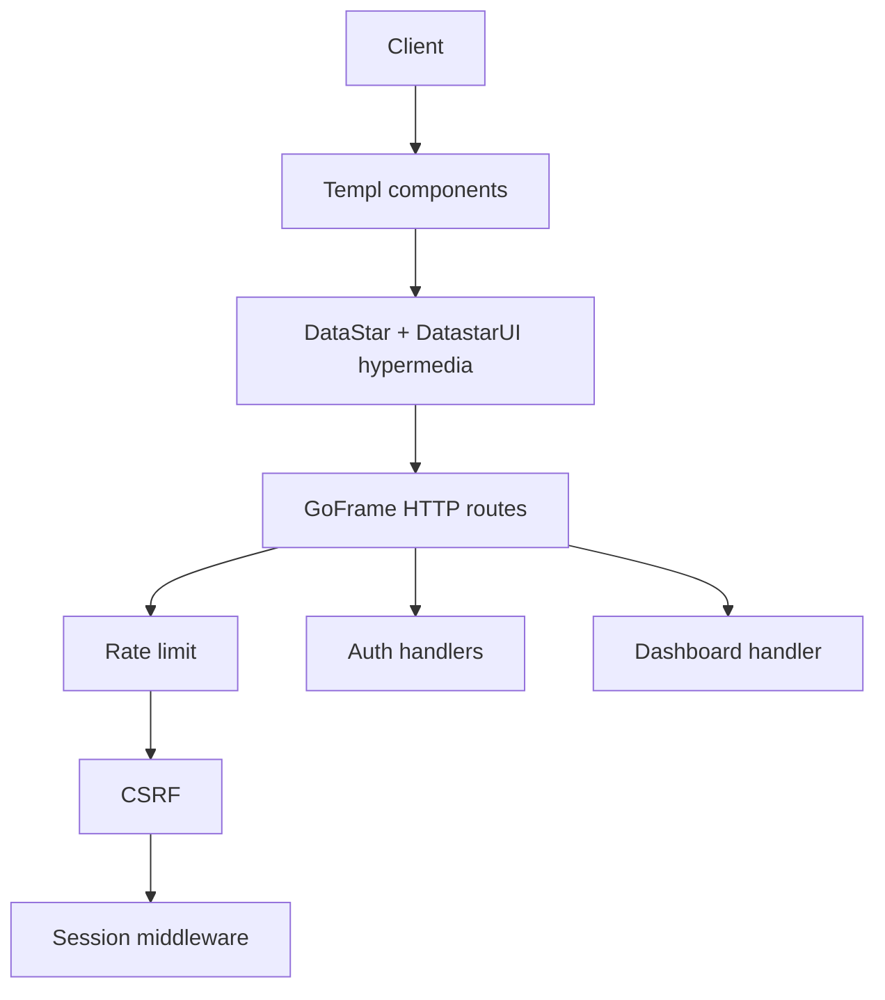

# Bootstrap the farm-manager application (templ + GoFrame + DataStar + DatastarUI + SQLite + session auth) — Login only + Blank Dashboard, Hypermedia (HATEOAS), no REST

You are generating the application layer for farm-manager on top of the existing project scaffold in [prompts/bootstrap-project.prompt.md](prompts/bootstrap-project.prompt.md). Scope is minimal: implement session-based authentication (login/logout) and a protected blank dashboard. Remove all domain/business entities (farms, fields, crops, tasks). Do not use REST-style APIs. Use a hypermedia (HATEOAS) approach with DataStar and DatastarUI, similar to HTMX: the server returns HTML fragments and the client updates the DOM declaratively via attributes.

Goals

- Minimal, production-ready scaffolding with session auth and a blank dashboard under base path /app.
- Hypermedia-first navigation and actions using DataStar + DatastarUI; no REST/JSON endpoints for this scope.
- Reusable templ components for layout, nav, forms, buttons, alerts, notifications, modals.
- SQLite for users only (for login), using the modernc.org/sqlite pure-Go driver to keep CGO disabled.
- CSRF protection on mutating requests, simple per-IP rate limiting, and 12-factor env configuration.

Tech stack

- Backend: Go 1.25, GoFrame v2, GoFrame ORM or direct database/sql (developer choice for users), modernc.org/sqlite.
- UI: templ components + DataStar + DatastarUI via CDN for progressive enhancement and hypermedia updates.
- Build/Tasks: reuse existing mise tasks (templ generate, run, build).

Environment variables

- PORT: HTTP port (default 8080).
- APP_BASE_PATH: /app (default /app).
- SQLITE_DSN: file:./data/app.db?cache=shared&mode=rwc
- SESSION_SECRET: 32+ bytes secret for session encryption/signing.
- RATE_LIMIT_RPS: requests per second per IP (default 10).
- RATE_LIMIT_BURST: burst size per IP (default 20).
- CSRF_COOKIE_NAME: cookie name for CSRF token (default csrf_token).
- CSRF_HEADER_NAME: header name for CSRF token (default X-CSRF-Token).
- ADMIN_PASSWORD: initial admin password for first-run seeding (no default; must be set).

Routing and auth (hypermedia, no REST)

- Public routes (no session required):
  - GET /app/login — renders a login form page using templ.
  - POST /app/login — processes login; on success, redirect to /app; on failure, re-render login with inline errors (HTML).
  - POST /app/logout — logs out; redirect to /app/login.
  - GET /healthz — unchanged for infra checks.
- Protected:
  - GET /app — blank dashboard shell (placeholder content), using shared layout and components.
- Do not create REST endpoints (no /api, no JSON contracts). All interactions are server-rendered HTML or HTML fragments exchanged via hypermedia links/buttons/forms.
- Session middleware using GoFrame sessions; missing/invalid session redirects to /app/login.
- Passwords stored as bcrypt hashes in users table. On first run, seed a default admin user if none exists and force change on first login is optional but recommended.
- Log access and errors via GoFrame logger; do not log sensitive info.

Hypermedia (HATEOAS) with DataStar/DatastarUI

- Use DataStar and DatastarUI declaratively to drive navigation and actions:
  - Links and buttons include attributes to fetch server-rendered HTML and swap into a target element (e.g., main content area).
  - Forms submit with CSRF token; server responds with full page or partial fragment; client swaps accordingly.
  - Avoid bespoke JSON endpoints; favor standard HTTP verbs returning HTML snippets.
- Progressive enhancement:
  - Ensure all pages render without JavaScript; DataStar/DatastarUI enhances UX with partial updates, modals, toasts, etc.
- Example conventions (pseudo-attributes; adjust to DatastarUI exact API):
  - data-star-get="/app/some-fragment" data-star-target="#content" data-star-swap="inner"
  - Forms include a hidden CSRF field and may submit with data-star-post.

Database schema (SQLite) — users only

- Keep only users for authentication; remove all other tables (farms, fields, crops, tasks).
- users: id PK, username UNIQUE, password_hash, force_password_change INT, created_at, updated_at, deleted_at NULL, created_by NULL, updated_by NULL
- Indices:
  - UNIQUE(username)
  - INDEX(deleted_at)
- Triggers to auto-update updated_at on update.
- Enforce foreign_keys PRAGMA; use modernc.org/sqlite to keep CGO disabled.

UI component library (templ + DataStar + DatastarUI)
Build reusable templ components under [internal/web/templates/components](internal/web/templates/components/):

- layout: app shell with header, footer, navigation slot, content slot; includes CDN scripts/styles for DataStar and DatastarUI; App base path in links.
- header: app title, user menu (logout button/form).
- footer: copyright, version.
- navigation: links to Dashboard (active highlight); may include placeholders for future sections.
- forms: Input, PasswordInput, FormRow, FieldError, HiddenCsrfField.
- buttons: Button variants (primary, secondary, danger), IconButton.
- alerts: Alert components (info, success, warning, danger).
- notifications: Toast container with DataStar-driven show/hide.
- modals: Basic Modal and ConfirmDialog for future use.

Pages (templ)

- Login page: uses forms components; shows validation errors inline; on success redirects to /app.
- Dashboard page: protected; renders blank content area with a placeholder card and a sample hypermedia link/button that fetches a small HTML fragment from the server and swaps it into a target div (demonstration only; no domain data).

Project structure (create or extend; domain removed)

- [cmd/farm-manager/main.go](cmd/farm-manager/main.go)
  - Register routes under /app, serve static assets under /public, apply rate limit, CSRF, session, and auth middleware; inject APP_BASE_PATH into templates.
- [internal/domain/models.go](internal/domain/models.go)
  - Keep only User struct and common audit fields; remove any other domain entities.
- [internal/db/sqlite.go](internal/db/sqlite.go)
  - Open DSN with modernc.org/sqlite; ensure data dir; foreign_keys and busy_timeout.
- [internal/db/migrate.go](internal/db/migrate.go)
  - Execute [db/migrations/0001_init.sql](db/migrations/0001_init.sql) containing only the users schema.
- [db/migrations/0001_init.sql](db/migrations/0001_init.sql)
  - Create users table and related indices/triggers only. Remove farms/fields/crops/tasks definitions.
- [internal/data/user_repo.go](internal/data/user_repo.go)
  - Minimal interface and SQLite implementation for users: FindByUsername, Create, Count, UpdatePassword, SoftDelete; used by auth handler.
- [internal/web/middleware/session.go](internal/web/middleware/session.go)
  - Session setup using SESSION_SECRET; helpers CurrentUser and RequireAuth (redirect to /app/login).
- [internal/web/middleware/csrf.go](internal/web/middleware/csrf.go)
  - CSRF token cookie issuance and validation for POST/PUT/PATCH/DELETE; templ helper to inject hidden field.
- [internal/web/middleware/rate_limit.go](internal/web/middleware/rate_limit.go)
  - Token-bucket limiter per IP using env-configured limits; return 429 on exceed.
- [internal/web/handlers/auth.go](internal/web/handlers/auth.go)
  - GET /app/login, POST /app/login, POST /app/logout; bcrypt verify; seed admin on first run (e.g., admin / admin123) if zero users but get password from env ADMIN_PASSWORD; optional force password change flow.
- [internal/web/handlers/dashboard.go](internal/web/handlers/dashboard.go)
  - GET /app: renders the blank dashboard layout plus placeholder content and a sample hypermedia fragment endpoint for DatastarUI demonstration.
- [internal/web/templates/components/.../*.templ](internal/web/templates/components/README.md)
  - Components as listed above.
- [internal/web/templates/pages/login.templ](internal/web/templates/pages/login.templ)
  - Login page.
- [internal/web/templates/pages/dashboard.templ](internal/web/templates/pages/dashboard.templ)
  - Dashboard page shell and a target div (e.g., id=content) for hypermedia swaps.
- [public/css/app.css](public/css/app.css), [public/js/app.js](public/js/app.js)
  - Minimal styling and DataStar bootstrapping; include DatastarUI CSS and DataStar/DatastarUI via pinned CDN.

Third-party inclusion

- DataStar: <https://github.com/starfederation/datastar> via CDN (pin a stable version).
- DatastarUI: <https://github.com/coreycole/datastarui> via CDN; the UI interactions are hypermedia-driven (HATEOAS), similar to HTMX: <https://htmx.org/essays/hateoas/>
- Avoid Node build steps; keep assets static.

Templ usage

- All HTML views are generated via templ .templ files; run mise run templ to build.
- Component APIs emphasize simple props and slots.
- Provide small helpers for active navigation and CSRF hidden field.

CSRF and rate limiting

- CSRF: token in cookie and hidden input; validate header for JS-enhanced submissions; 403 on invalid/missing token.
- Rate limiting: per-IP token bucket; env-configurable; return 429 with a simple error page.

Acceptance criteria

- Login flow works; authenticated users reach /app; unauthenticated users are redirected to /app/login.
- No REST endpoints exist (no /api; no JSON contracts required). Navigation and actions use hypermedia with server-rendered HTML and DataStar/DatastarUI-driven swaps.
- Dashboard renders using templ shared layout and components with a placeholder content area and at least one working hypermedia demo interaction.
- DSN from SQLITE_DSN is respected; database file created at first run; users table migrated on startup.
- No CGO dependency; binary builds with CGO_ENABLED=0 and runs successfully.
- All app routes are mounted under /app; static assets served from /public.
- mise run templ, run, and build tasks succeed; health check /healthz remains available.

Deliverables
Generate or update the following with complete, working implementations:

- [cmd/farm-manager/main.go](cmd/farm-manager/main.go)
- [internal/domain/models.go](internal/domain/models.go)
- [internal/db/sqlite.go](internal/db/sqlite.go)
- [internal/db/migrate.go](internal/db/migrate.go)
- [db/migrations/0001_init.sql](db/migrations/0001_init.sql)
- [internal/data/user_repo.go](internal/data/user_repo.go)
- [internal/web/middleware/session.go](internal/web/middleware/session.go)
- [internal/web/middleware/csrf.go](internal/web/middleware/csrf.go)
- [internal/web/middleware/rate_limit.go](internal/web/middleware/rate_limit.go)
- [internal/web/handlers/auth.go](internal/web/handlers/auth.go)
- [internal/web/handlers/dashboard.go](internal/web/handlers/dashboard.go)
- [internal/web/templates/components/.../*.templ](internal/web/templates/components/README.md)
- [internal/web/templates/pages/login.templ](internal/web/templates/pages/login.templ)
- [internal/web/templates/pages/dashboard.templ](internal/web/templates/pages/dashboard.templ)
- [public/css/app.css](public/css/app.css)
- [public/js/app.js](public/js/app.js)
- Unit tests: minimal auth and middleware tests under internal/.../_test.go

Mermaid overview

Notes

- Keep code small and readable; favor composition.
- Use context on all DB operations; log errors via GoFrame logger; do not log secrets.
- Seed an admin user on first run only when users table is empty; document default credentials in README and recommend changing immediately.

Instructions

- Create all files and directories exactly as listed. Populate them with working code and templates.
- Ensure all imports compile with the versions in go.mod and that CGO remains disabled.
- Provide a short README section describing how to run migrations, start the app, and log in for the first time.
- After generation, run mise run templ and mise run run to verify the app operates under /app with hypermedia navigation and no REST endpoints.
